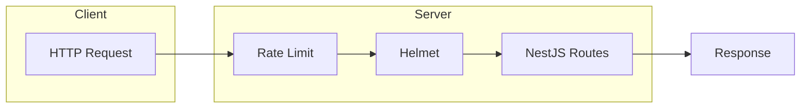
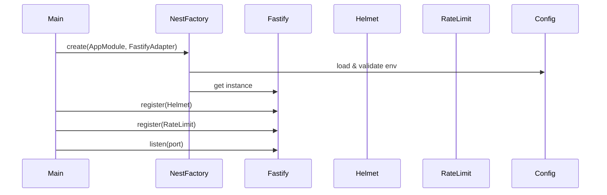
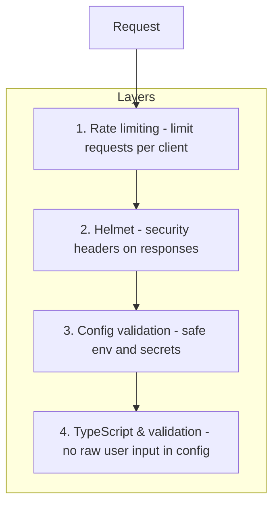

# Test Repository for Security Best Practices in NestJS

A NestJS application demonstrating security best practices including HTTP security headers (Helmet), request rate limiting, and secure handling of environment variables and API keys.

---

## Table of Contents

1. [Overview](#overview)
2. [Features](#features)
3. [Dependencies](#dependencies)
4. [Code Change Summary](#code-change-summary)
5. [Change History](#change-history)
6. [Architecture and Flow](#architecture-and-flow)
7. [Security Measures](#security-measures)
8. [Environment Variables](#environment-variables)
9. [Installation](#installation)
10. [Running the Application](#running-the-application)
11. [Testing](#testing)
12. [Debugging](#debugging)
13. [Project Structure](#project-structure)
14. [Configuration Reference](#configuration-reference)
15. [Documentation and Linting](#documentation-and-linting)

---

## Overview

This project is a minimal NestJS backend built with the **Fastify** adapter. It illustrates how to harden a NestJS API against common risks such as missing security headers, abuse from excessive requests, and misconfiguration of sensitive settings. The codebase uses TypeScript with strict typing and Doxygen-style documentation throughout.

---

## Features

- **Fastify adapter:** NestJS runs on Fastify for high throughput and a plugin-based pipeline.
- **@fastify/helmet:** Security-related HTTP headers (X-Content-Type-Options, X-Frame-Options, etc.) are set on every response.
- **@fastify/rate-limit:** Global rate limiting (e.g. 100 requests per minute per client) to reduce abuse and brute-force risk.
- **@nestjs/config with Joi:** Environment variables are validated at startup via a Joi schema. Invalid or missing required values fail fast.
- **Secure configuration:** API keys and secrets are intended to be supplied via environment variables (or a secret manager in production), not hardcoded.
- **Health endpoint:** `GET /health` returns a simple JSON status for liveness and readiness checks.
- **Unit and e2e tests:** Jest tests for services, controllers, config schema, and HTTP endpoints.

---

## Dependencies

### Production

| Package | Purpose |
| --- | --- |
| `@fastify/helmet` | Sets security HTTP headers (Helmet for Fastify). |
| `@fastify/rate-limit` | Request rate limiting per client (e.g. by IP). |
| `@nestjs/common` | NestJS core utilities and decorators. |
| `@nestjs/config` | Configuration module and env validation. |
| `@nestjs/core` | NestJS application runtime. |
| `@nestjs/platform-fastify` | Fastify adapter for NestJS. |
| `fastify` | Fast HTTP server and plugin system. |
| `joi` | Schema-based validation for environment variables. |
| `reflect-metadata` | Metadata reflection used by NestJS. |
| `rxjs` | Reactive extensions used by NestJS. |

### Development

| Package | Purpose |
| --- | --- |
| `@nestjs/cli` | Nest CLI (build, start, generate). Pinned to ^11.0.16 to avoid high-severity vulnerabilities. |
| `@nestjs/schematics` | Code generators for NestJS. |
| `@nestjs/testing` | Testing utilities and mocks. |
| `@types/jest`, `@types/node` | TypeScript type definitions. |
| `@typescript-eslint/*` | ESLint rules for TypeScript. |
| `eslint`, `eslint-config-prettier`, `eslint-plugin-prettier` | Linting and formatting. |
| `jiti` | Loader for TypeScript config files (e.g. `eslint.config.ts`) on Node before 22.10. |
| `jest`, `ts-jest` | Unit and integration test runner. |
| `prettier` | Code formatter. |
| `ts-loader`, `ts-node`, `typescript` | TypeScript compilation and execution. |

---

## Code Change Summary

- **Bootstrap (`src/main.ts`):** NestJS is created with `FastifyAdapter`. Before any routes, the Fastify instance registers `@fastify/helmet` and `@fastify/rate-limit`. The server listens on `PORT` from the environment (default 3000).
- **Configuration:** `ConfigModule` is loaded globally in `AppModule` with a Joi `validationSchema` (see `src/config/config.schema.ts`). Variables such as `NODE_ENV`, `PORT`, and optional `API_KEY` and `DATABASE_URL` are validated at startup.
- **Routes:** `AppController` exposes `GET /` (greeting) and `GET /health` (health check). Both are protected by the same rate limit and security headers.
- **Tests:** Unit tests for `AppService`, `AppController`, and the config schema. E2e tests for the Fastify app using `inject()` to call `/` and `/health` without binding to a port.
- **Tooling:** `tsconfig.json` uses `inlineSourceMap: true`, `inlineSources: true`, `sourceMap: false`, `removeComments: false`. `package.json` sets `"license": "MIT"`, `"@nestjs/cli": "^11.0.16"`, and `"engines": { "node": ">=20.0.0" }`. Configuration is TypeScript-only: `eslint.config.ts` and `jest.config.ts` (no JavaScript config files).

---

## Change History

The following changes are documented for maintainers and contributors. All wording uses formal British English.

### Configuration and tooling

- **ESLint:** The project uses ESLint 9 with the flat config format. The configuration file is `eslint.config.ts` (TypeScript), not `eslint.config.js`. The flat config defines ignores, TypeScript parsing and recommended rules for `src`, `test`, and `jest.config.ts`, and applies `eslint-config-prettier` last. The `jiti` package is included as a devDependency so that ESLint can load the TypeScript config on Node versions before 22.10.
- **Jest:** The Jest configuration is in `jest.config.ts` (TypeScript), not `jest.config.js`. The config exports a typed `Config` object and is consumed by Jest when running `npm test`. The test pattern matches both `*.spec.ts` and `*-spec.ts` so that unit and e2e specs are discovered.
- **TypeScript:** Only TypeScript is used for application and config code. No JavaScript config or source files remain. Explicit types and Doxygen-style comments are used throughout.

### Documentation

- **Doxygen:** All source and config files are documented with Doxygen-style comments. File headers use `@file`, `@brief`, `@details`, `@author`, `@date`, and `@copyright`. Functions and methods use `@fn`, `@type function`, `@param name { Type }`, and `@returns { Type }`. Variables and members use `@var`, `@type`, and `@details`. Classes use `@class` and `@type class`. Constructors are documented as functions with `@fn constructor` and `@param`. Every documented item includes a `@details` paragraph. A `Doxyfile` is provided. Running `doxygen Doxyfile` generates HTML under `docs/`. The README is set as the main page of the generated documentation via `USE_MDFILE_AS_MAINPAGE = README.md` and is included in `INPUT`.
- **README:** This file is the main page of the Doxygen output. It is written in formal British English and describes features, dependencies, security measures, installation, testing, debugging, project structure, and configuration.

### Code and tests

- **Linting:** The unused `joi` import was removed from `src/config/config.schema.spec.ts`. The spec uses only `ConfigValidationSchema` from the schema module.
- **E2E tests:** The e2e suite uses the Fastify adapter and obtains the Fastify instance via `getHttpAdapter().getInstance()` to call `inject()` for HTTP requests without binding to a port.
- **Git:** The `docs/` directory (Doxygen output) is listed in `.gitignore` so that generated documentation is not committed.

---

## Architecture and Flow

### Request flow (high level)



### Application bootstrap sequence



### Security layers



---

## Security Measures

- **Helmet:** Reduces exposure to XSS, clickjacking, and MIME sniffing by setting headers such as `X-Content-Type-Options`, `X-Frame-Options`, and related policies. CSP is disabled in this example. Enable and tune it if you serve HTML.
- **Rate limiting:** Each client (by IP) is limited to a fixed number of requests per time window. Excess requests receive HTTP 429. This mitigates brute-force and denial-of-service style abuse.
- **Environment variables:** Secrets (API keys, database URLs) are not stored in code. They are read from the environment and validated with Joi so that typos or invalid values are caught at startup.
- **.env not committed:** `.env` and similar files are in `.gitignore`. Use `.env.example` as a template and document required variables only.

---

## Environment Variables

| Variable | Required | Description |
| --- | --- | --- |
| `NODE_ENV` | No (default: development) | One of: development, production, test. |
| `PORT` | No (default: 3000) | TCP port for the HTTP server (1-65535). |
| `API_KEY` | No | Optional API key for external services. |
| `DATABASE_URL` | No | Optional database connection URI. |

Copy `.env.example` to `.env` and fill in values for local development. Never commit `.env` or real secrets.

---

## Installation

Prerequisites: Node.js v20 or later.

```bash
git clone https://github.com/yjfvictor/test-repo-for-security-best-practices-in-NestJS.git
cd test-repo-for-security-best-practices-in-NestJS
npm install
```

---

## Running the Application

- **Development (watch mode):**

  ```bash
  npm run start:dev
  ```

- **Production build and run:**

  ```bash
  npm run build
  npm run start:prod
  ```

- **Default URL:** `http://localhost:3000` (or the value of `PORT`).

---

## Testing

- **Run all tests (unit + e2e):**

  ```bash
  npm test
  ```

- **Watch mode:**

  ```bash
  npm run test:watch
  ```

- **Coverage:**

  ```bash
  npm run test:cov
  ```

- **Debug tests:**

  ```bash
  npm run test:debug
  ```

Tests include:

- `AppService` and `AppController` unit tests (mocked dependencies).
- Config schema validation (valid and invalid env objects).
- E2E: `GET /` and `GET /health` via Fastify `inject()`.

---

## Debugging

- **Start app with Node inspector:**

  ```bash
  npm run start:debug
  ```

  Then attach a debugger (e.g. VS Code) to the default port.

- **Debug Jest:**

  ```bash
  npm run test:debug
  ```

  Attach to the process to step through tests.
- **Logs:** Fastify logger is enabled in development. Adjust in `main.ts` if needed.

---

## Project Structure

```text
test-repo-for-security-best-practices-in-NestJS/
├── src/
│   ├── config/
│   │   ├── config.schema.ts       # Joi env validation
│   │   └── config.schema.spec.ts
│   ├── app.module.ts
│   ├── app.controller.ts
│   ├── app.controller.spec.ts
│   ├── app.service.ts
│   ├── app.service.spec.ts
│   └── main.ts                    # Bootstrap, Helmet, rate-limit
├── test/
│   └── app.e2e-spec.ts            # E2E for / and /health
├── .env.example
├── Doxyfile                       # Doxygen config, output in docs/
├── eslint.config.ts              # ESLint 9 flat config (TypeScript)
├── jest.config.ts                # Jest config (TypeScript)
├── nest-cli.json
├── package.json
├── tsconfig.json
├── LICENSE
└── README.md
```

---

## Configuration Reference

- **Rate limit:** In `main.ts`, `max: 100` and `timeWindow: '1 minute'`. Change these to match your SLA and abuse tolerance.
- **Helmet:** `contentSecurityPolicy: false` in `main.ts`. Set to a policy object if you serve HTML and need CSP.
- **Config validation:** Edit `src/config/config.schema.ts` to add or change env variables and rules.

---

## Documentation and Linting

- **Doxygen:** Install Doxygen (if not present) and run `doxygen Doxyfile` from the project root. HTML is written to `docs/html/`. Open `docs/html/index.html` for the main page (this README). The `docs/` directory is gitignored.
- **ESLint:** Run `npm run lint` to lint TypeScript under `src`, `apps`, `libs`, and `test`. The configuration lives in `eslint.config.ts` and uses the TypeScript parser and recommended rules plus Prettier compatibility.
- **Prettier:** Run `npm run format` to format `src` and `test` TypeScript files. ESLint and Prettier are configured so that they do not conflict.
